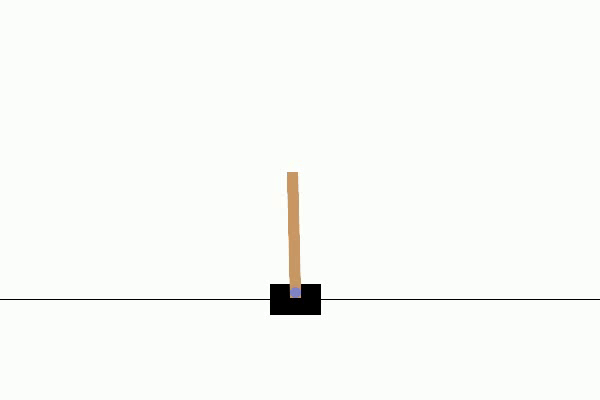

# Cartpole-RL
This is an exercise on using Q-Learning models for OpenAI's gym environment, specifically the `cartpoel-v1` environment. The model is designed with straightforward `nn.Linear` layers and `ReLU` as its activation functions, culminating in roughly 898 parameters and 6 kilobytes to store weights. Interestingly, the model was able to achieve convergence (sustaining 500 timesteps) regardless of the specific initial config values, so long as total episodes is sufficiently long.

`finetune.py` was still implemented to discover favorable initial configs, running on shorter episodes for faster hyperparameter searching. From the trials, `epsilon_decay` between 0.92 and 0.94, `gamma` between 0.93 and 0.97 while keeping `learning rate` at `4e-4` yielded favorable results more often.

## Results
<p align="center">
  
</p>

## Installation
1. Git clone the repository:
```bash
git clone https://github.com/CodeKnight314/Cartpole-RL.git
```

2. Create and activate a virtual environment (optional but recommended):
```bash
python -m venv cartpole-env
source cartpole-env/bin/activate
```

3. Install necessary pacakages
```bash 
pip install -r src/requirements.txt
```

## Training
You can start the training process via: 
```bash
python src/main.py --c path/to/config --o path/to/outputs --train
```

This will start the training process based on the given configs then record the cartpole model in simulation before saving to specified directory. 

## Testing 
You can start the testing process via: 
```bash 
python src/main.py --c path/to/config --o path/to/outputs --w path/to/weights --test
```
